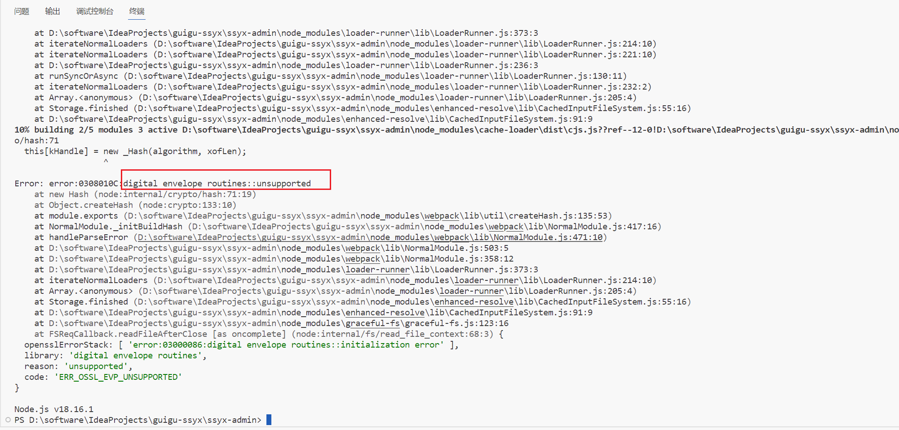

# 仓库介绍

本仓库是尚硅谷尚上优选项目的[前端仓库](https://github.com/hello-github-ui/guigu-ssyx)，其相应的后端仓库[在这里](https://github.com/hello-github-ui/guigu-ssyx-parent)。

> ssyx-admin 是平台管理端的前端项目

# 平台管理端前端项目

进入项目 ssyx-admin 后，如果你执行 `npm run dev` 后，报如下错误：

该错误通常是由于你本地安装的nodejs版本过高导致的报错，你需要下载 [这个版本](https://nodejs.org/download/release/v16.16.0/) 安装即可。

然后，将你的node_modules目录删除掉，重新执行 `npm install` 即可。

